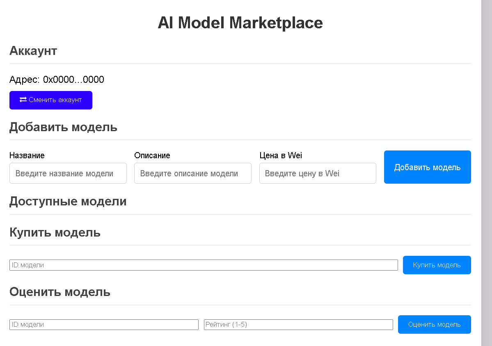

init
# AI Model Marketplace

The **AI Model Marketplace** is a decentralized application (dApp) built on Ethereum. It allows users to list, purchase, and rate AI models on a blockchain-based platform. This project uses Solidity for smart contracts, Web3.js for blockchain interaction, and HTML/CSS/JavaScript for the frontend.

## Usage

1. **Install MetaMask**  
   Ensure you have the MetaMask extension installed in your browser to interact with the dApp.

2. **Switch Accounts**  
   Use the **Switch Account** button to connect to your desired Ethereum account. The current account will be displayed on the page.

3. **Add Model**  
   Use the form to add a new AI model by providing the model's name, description, and price (in Wei).

4. **View Models**  
   The list of available models will be displayed dynamically on the page. Each model includes details such as its name, description, price, and rating.

5. **Purchase Model**  
   Enter the model's ID and click the **Purchase Model** button to buy it. The transaction will be processed on the blockchain.

6. **Rate Model**  
   After purchasing a model, you can rate it using the **Rate Model** section. Provide the model's ID and your rating (from 1 to 5).

7. **View Model Details**  
   Enter the model's ID to retrieve and view detailed information about the model, including the total rating and rating count.

## Demo

1. **Adding a Model:**
   - Model Name: `AI Image Generator`
   - Description: `Generates high-quality images from text prompts.`
   - Price: `1000000000000000000` (1 ETH)

2. **Purchasing a Model:**
   - Model ID: `1`
   - Purchase price: `1 ETH`

3. **Rating a Model:**
   - Model ID: `1`
   - Rating: `5`

